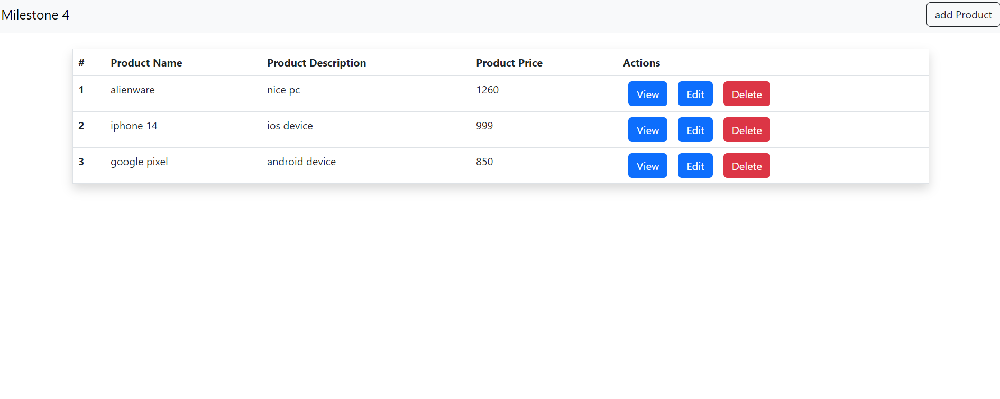
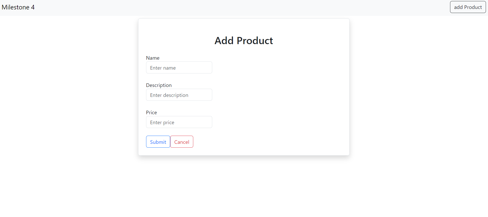
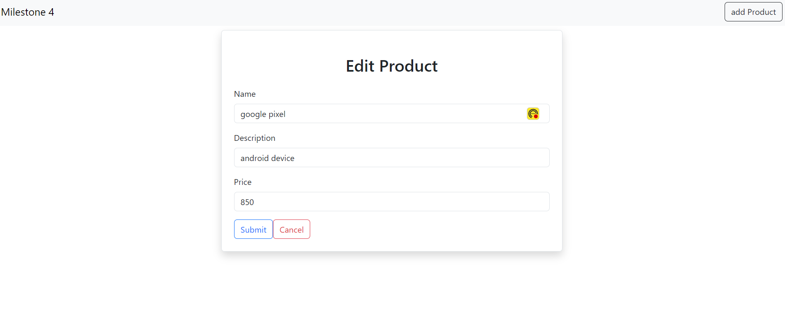
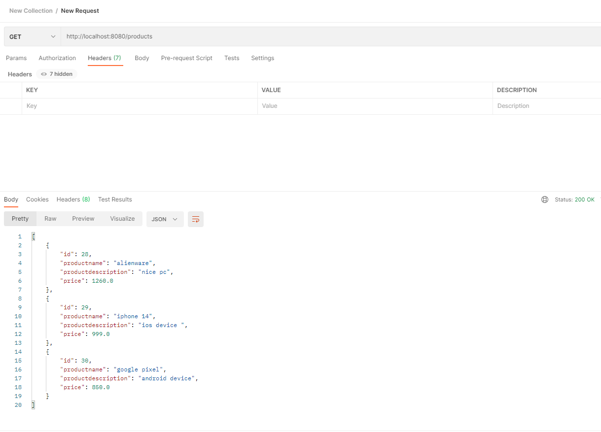
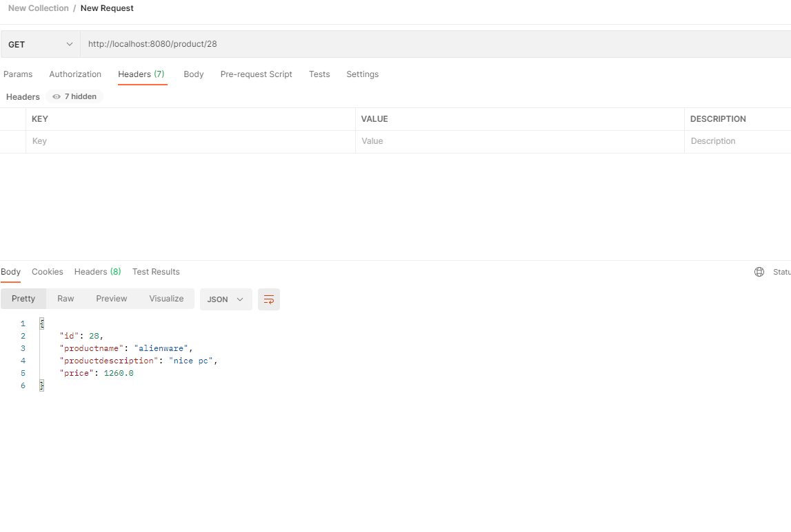
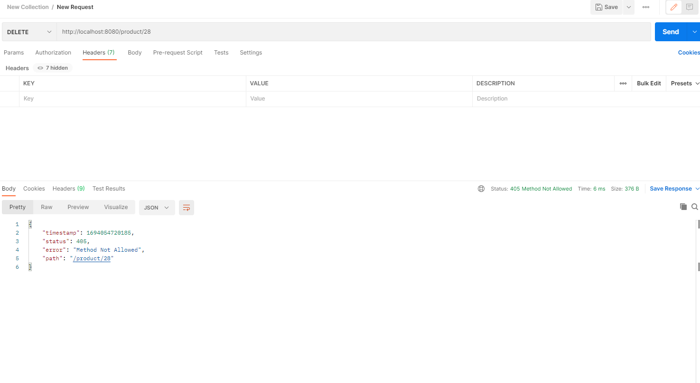

---

# Project Completion
## Global CORS Configuration

This project contains a global CORS (Cross-Origin Resource Sharing) configuration to allow cross-origin requests for the Spring Boot application. The configuration is set up using the following Java code:

```java
@Configuration
@EnableWebMvc
public class GlobalCorsConfiguration implements WebMvcConfigurer {

    @Override
    public void addCorsMappings(CorsRegistry registry) {
        registry.addMapping("/**")
            .allowedOrigins("*")
            .allowedMethods("GET", "POST", "PUT", "DELETE", "OPTIONS", "PATCH")
            .allowedHeaders("*");
    }
}
```

## Milestone4 Application

The primary application class, `Milestone4Application`, is responsible for starting the Spring Boot application:

```java
@SpringBootApplication(scanBasePackages = "com.milestone4")
public class Milestone4Application {

    public static void main(String[] args) {
        SpringApplication.run(Milestone4Application.class, args);
    }
}
```

## Product Controller

The `ProductController` class serves as the REST API controller for managing product-related operations, including:

- Creating a new product: `POST /product`
- Getting all products: `GET /products`
- Getting a product by ID: `GET /product/{id}`
- Updating a product: `PUT /product/{id}`
- Deleting a product: `DELETE /products/{id}`
- Handling OPTIONS requests: `OPTIONS /products/{id}`

The controller interacts with the underlying database using the `ProductRepository`.

## Product Model

The `Product` class represents the product entity in the database. It includes fields for `id`, `productName`, `productDescription`, and `price`.

## Product Repository

The `ProductRepository` interface extends `JpaRepository` and is used for CRUD (Create, Read, Update, Delete) operations on the `Product` entity.

## Exception Handling

Exception handling related to product not found scenarios is implemented using custom exception classes and a controller advice:

- `ProductNotFoundException` is a custom exception thrown when a product with a given ID is not found.
- `ProductNotFoundAdvice` is a controller advice class that handles the `ProductNotFoundException` and returns an appropriate error message.

## Tests

Several unit tests are included to ensure the functionality of the application and exception handling:

- `ProductControllerTest` tests various methods of the `ProductController` class.
- `ProductNotFoundExceptionTest` tests the custom exception message in `ProductNotFoundException`.
- `ProductTest` tests the `Product` class for proper attribute setting and validation.

## Features

- Cross-Origin Resource Sharing (CORS) configuration is globally set to allow various HTTP methods and headers from any origin.
- The RESTful API provides endpoints to manage products, including creation, retrieval, updating, and deletion.
- Exception handling ensures proper error messages are returned when products are not found.

## Dependencies

- Spring Boot: A framework for creating standalone, production-grade Spring-based applications.
- Spring Data JPA: Simplifies database access and management using the Java Persistence API.
- JUnit 5: A testing framework for unit tests.
- H2 Database: An in-memory database for testing purposes.

## Usage

1. Clone the repository to your local machine.
2. Open the project in your preferred Java IDE.
3. Run the `Milestone4Application` class to start the Spring Boot application.
4. Utilize the provided API endpoints to interact with products.

## API Endpoints

- Create a new product:
    - `POST /product`

- Get all products:
    - `GET /products`

- Get a product by ID:
    - `GET /product/{id}`

- Update a product:
    - `PUT /product/{id}`

- Delete a product:
    - `DELETE /products/{id}`

- OPTIONS request:
    - `OPTIONS /products/{id}`

## Project Requirements Assessment

This project fulfills the following requirements:

- Implements a global CORS configuration to enable cross-origin requests.
- Provides a RESTful API for CRUD operations on product entities.
- Includes exception handling for cases where products are not found.
- Contains unit tests to validate the functionality and exception handling.
- Utilizes Spring Boot, Spring Data JPA, and JUnit for implementation and testing.

  Test Plan: Component Testing
Test Approach
The component testing approach for the "CST 452 Product Management" project is designed to ensure the functionality and performance of the Product Controller. The focus is on testing individual components or units of the system to verify that they operate correctly.

Test Tools
JUnit
Component: Product Controller
Functionality

Add Product: Verify the ability to add a new product using a POST request.
Edit: Validate the ability to edit a product.
Delete: Confirm the ability to delete a product by ID.
Read All: Ensure the ability to retrieve all products.
Performance

N/A
Component Test Checklist
Test Case	Test Description	Developer	Reviewer	Comments
Add Product	Verify the addition of a new product using a POST request.	Vrijesh		Pass
Edit	Validate the ability to edit a product.	Vrijesh		Pass
Delete	Confirm the ability to delete a product by ID.	Vrijesh		Pass
Read All	Ensure the ability to retrieve all products.	Vrijesh		Pass
Date: 8/27/23

Final Sign-Off and Approval
Project Name: CST 452 Product Management
Date: 8/27/23
Test Plan: Unit Testing
Test Approach
The unit testing approach for the "CST 452 Product Management" project is aimed at testing individual units of code in isolation, typically at the method level. The primary goal is to validate the functionality of methods within the application.

Certainly, I've created test plans for both Component Testing and Unit Testing for the "CST 452 Product Management" project. Please note that you may need to tailor these plans to your specific project requirements and add dates as needed.

---

## Test Plan: Component Testing

### Test Approach
The component testing approach for the "CST 452 Product Management" project is designed to ensure the functionality and performance of the Product Controller. The focus is on testing individual components or units of the system to verify that they operate correctly.

### Test Tools
1. JUnit

### Component: Product Controller

- **Functionality**
  - Add Product: Verify the ability to add a new product using a POST request.
  - Edit: Validate the ability to edit a product.
  - Delete: Confirm the ability to delete a product by ID.
  - Read All: Ensure the ability to retrieve all products.


### Component Test Checklist

| Test Case      | Test Description                    | Developer | Reviewer | Comments |
| -------------- | ---------------------------------- | --------- | -------- | -------- |
| Add Product    | Verify the addition of a new product using a POST request. | Vrijesh |          | Pass     |
| Edit           | Validate the ability to edit a product. | Vrijesh |          | Pass     |
| Delete         | Confirm the ability to delete a product by ID. | Vrijesh |          | Pass     |
| Read All       | Ensure the ability to retrieve all products. | Vrijesh |          | Pass     |

**Date**: 8/27/23

### Final Sign-Off and Approval

- **Project Name**: CST 452 Product Management
- **Date**: 8/27/23

---

## Test Plan: Unit Testing

### Test Approach
The unit testing approach for the "CST 452 Product Management" project is aimed at testing individual units of code in isolation, typically at the method level. The primary goal is to validate the functionality of methods within the application.

### Test Tools
1. JUnit

### Unit Test Checklist

| Test Case             | Test Description                                           | Developer | Reviewer | Comments |
| --------------------- | --------------------------------------------------------- | --------- | -------- | -------- |
| Test GetProduct       | Verify the GetProduct method functionality.              | Vrijesh   |          | Pass     |
| Test GetProductById   | Validate the GetProductById method functionality.        | Vrijesh   |          | Pass     |
| Test UpdateProduct    | Mock the UpdateProduct method functionality.             | Vrijesh   |          | Pass     |
| Test DeleteProduct    | Validate the DeleteProduct method functionality.         | Vrijesh   |          | Pass     |
| Error Handling        | Ensure methods throwing ProductNotFoundException are tested. | Vrijesh |       | Pass     |
| Test Product Creation | Ensure that the Product class's getters and setters work correctly, allowing for the proper creation and manipulation of product objects. | Vrijesh | | Pass |
| Cross-Origin and Options Requests | Validate cross-origin annotations using @CrossOrigin. | Vrijesh | | Pass |

### Unit Testing Details

- **Test GetProduct:**
  - Mock the `productRepository.findAll` method to return a list of products.
  - Validate that the returned list of products matches the expected list.

- **Test GetProductById:**
  - Mock the `productRepository.findById` method to return a product for a given ID.

- **Test UpdateProduct:**
  - Mock the `productRepository.findById` method to return an existing product for a given ID.

- **Test DeleteProduct:**
  - Mock the `productRepository.existsById` method to return true for an existing product ID.

- **Error Handling:**
  - Ensure that methods that throw a `ProductNotFoundException` are tested for the correct exception behavior.

- **Test Product Creation:**
  - Test that the Product class's getters and setters work as expected, allowing for the proper creation and manipulation of product objects.

- **Cross-Origin and Options Requests:**
  - Validate that cross-origin annotations are applied correctly using `@CrossOrigin`.

**Date**: 8/27/23

### Final Sign-Off and Approval

- **Milestone 4 Tests **: CST 452 Product Management
- **Date**: 8/27/23

---
## Screen shot









## Conclusion

This Spring Boot application serves as an example of building a robust RESTful API for managing products. It incorporates global CORS configuration for secure cross-origin requests and handles exceptions gracefully. You can create, retrieve, update, and delete products using various HTTP methods. The project adheres to industry best practices and coding standards, offering a solid foundation for further development and expansion. 

## Loom videos:

- Code Review part 1 https://www.loom.com/share/e37a3082b0924826a0ae3dfdc984f392
- Code Review part 2 https://www.loom.com/share/3d7b8c5c0f7742388f405f041428a842
- Code Review Part 3 https://www.loom.com/share/ae71c8cc23684463a23dee0f8e8f19c6
- Code Review Part 4 https://www.loom.com/share/a7036c79e2194b2f956e1b0194cc7057
- Final Demonstration https://www.loom.com/share/243d98c850544e73b356367d12c61d25
